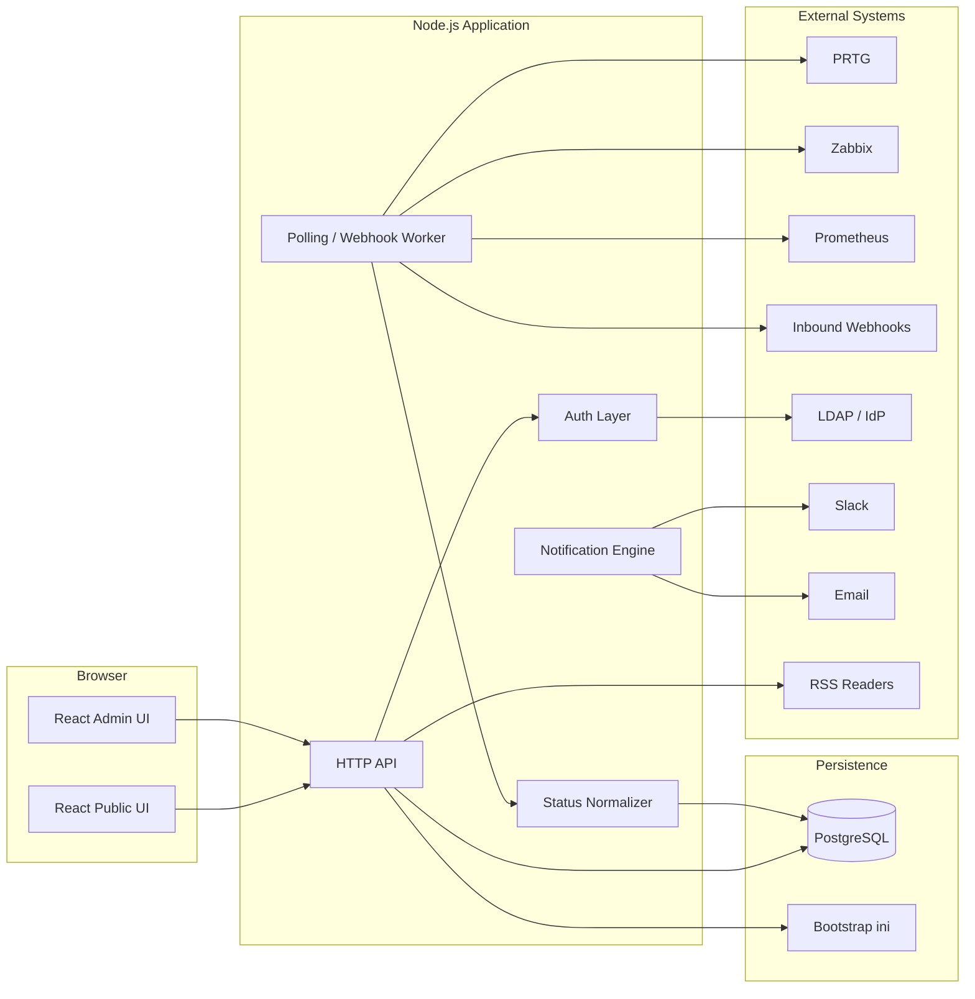

# Architecture Overview

## Goals

Provide a public status page that:
- shows normalized status for multiple tenants
- supports configurable tabs and banners
- avoids live querying external monitoring systems from the UI
- can be deployed in Docker containers
- supports theming, branding, and configurable color mappings

## High-Level Layout

## Runtime Services

### Web/API Service
- Serves the public and admin React applications.
- Exposes read and write APIs.
- Handles authentication, sessions, and authorization.
- Serves the latest cached status snapshot, daily rollups, and configuration.

### Worker Service
- Polls external monitoring systems on a schedule.
- Processes inbound webhooks.
- Normalizes source data into the internal status model.
- Persists the latest snapshot per tenant, daily rollups, incidents, banners, and maintenance transitions.
- Triggers RSS, Slack, and email notifications.

### Database
- Stores runtime configuration, current status cache, and daily history rollups.
- Supports tenant separation and auditability.

## Design Constraints

- The UI must never be the component that contacts monitoring backends.
- Polling intervals must be configurable and default to 5 minutes.
- The system must degrade gracefully if one external connector fails.
- Status color mapping must be configurable by admin.
- Application name and logo must be configurable.

## Tenant Strategy

Each tenant is a logical location or domain. A tenant owns:
- tabs
- services
- banners
- branding
- connector definitions
- notification settings
- color mapping overrides

Tenant isolation is logical first. Physical isolation is not required for the initial design.
